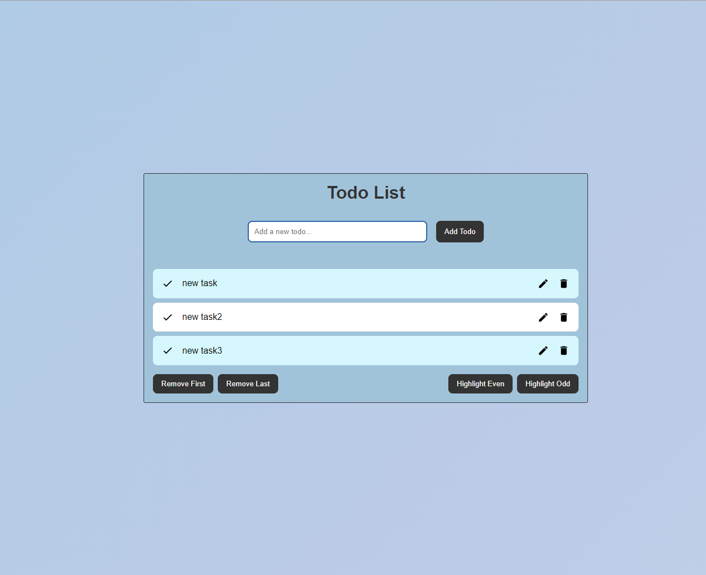
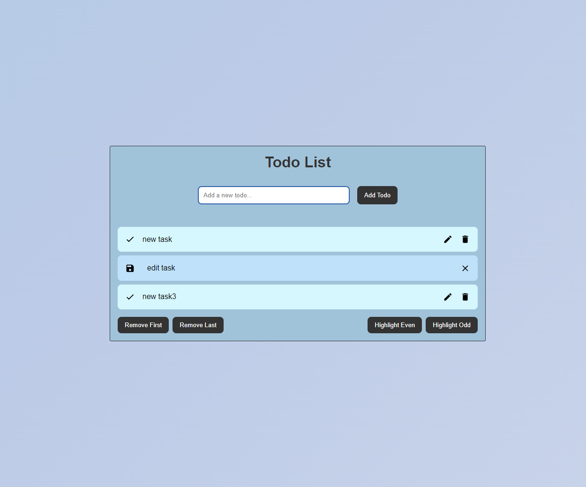

# Todo List на React + MobX

## Описание
Это приложение Todo List, реализованное с использованием React и MobX. Оно позволяет пользователям добавлять, 
удалять, обновлять и помечать задачи как завершенные. Также предусмотрены функции выделения четных и нечетных элементов,
а также удаления первого и последнего элемента списка.

## Использование

- **Добавление задачи:** Введите текст задачи в поле ввода и нажмите кнопку "Добавить".
- **Удаление задачи:** Нажмите кнопку "Удалить" рядом с задачей.
- **Пометить как завершенную:** Нажмите кнопку "Завершить" рядом с задачей, чтобы переместить её в конец списка.
- **Удалить первый/последний элемент:** Используйте кнопки "Удалить первый" и "Удалить последний" для управления списком.
- **Выделение четных/нечетных элементов:** Нажмите соответствующие кнопки для выделения элементов списка.

## Технологии

- **React:** Библиотека для создания пользовательских интерфейсов.
- **MobX:** Библиотека для управления состоянием приложения.

## Скриншоты

